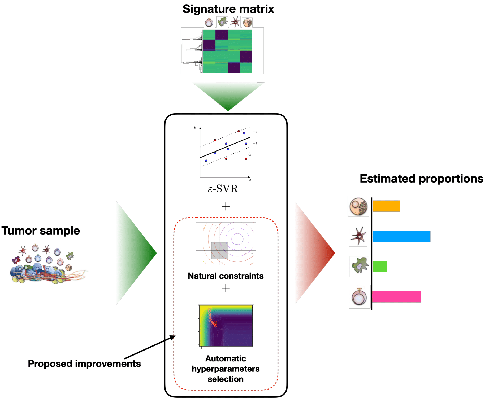

# Automatic hyperparameters selection and Constrained Support Vector Regression for deconvolution

___
AC-SVR relies on the Support Vector Regression estimator as already used by Cibersort.
However, AC-SVR takes into account the natural constraints related to the estimation cell populations proportions. 
Moreover, taking advantages of automatic differentiation, we implemented an efficient hyperparameters selection strategy to select the two hyperparameters of the SVR.
This strategy is faster than the classical grid-search. 

--- 

## Installation guide
To run the code you first need to clone the repository, and then run, in the folder containing the setup.py file (root folder):

`pip install -e .`

or its user version to install locally

`pip install --user -e .`

---

## Documentation and examples

---

## Cite

